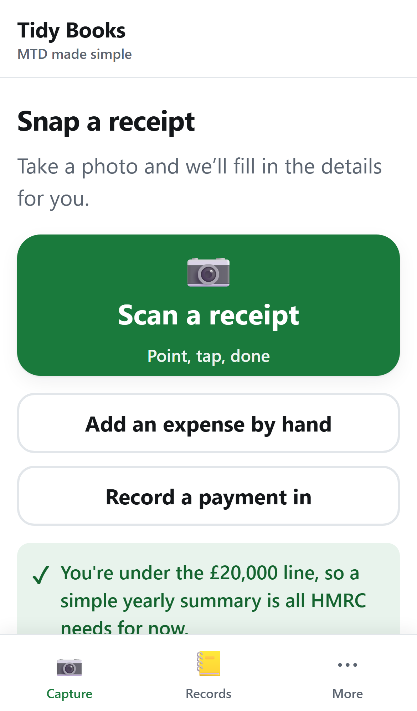
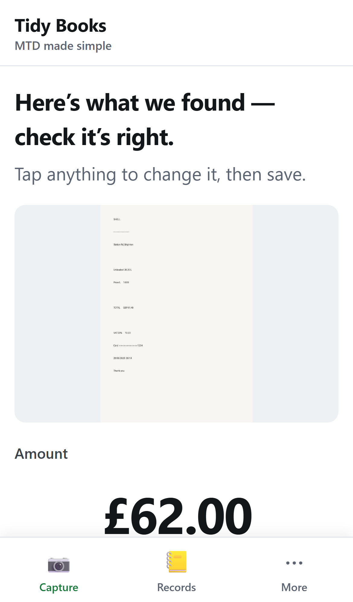
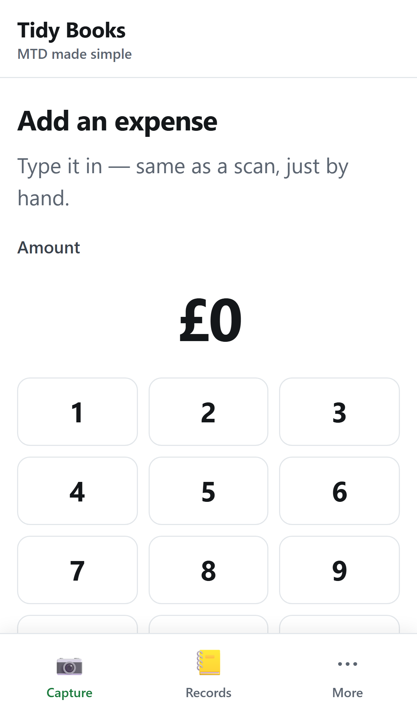
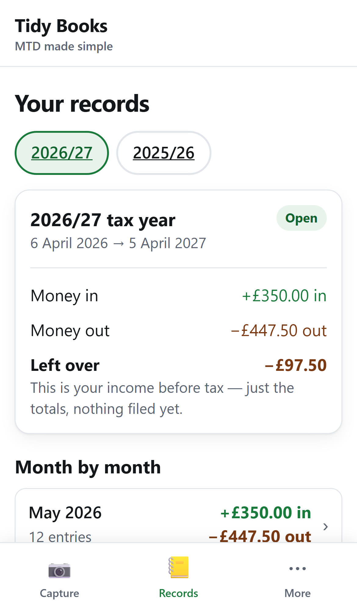
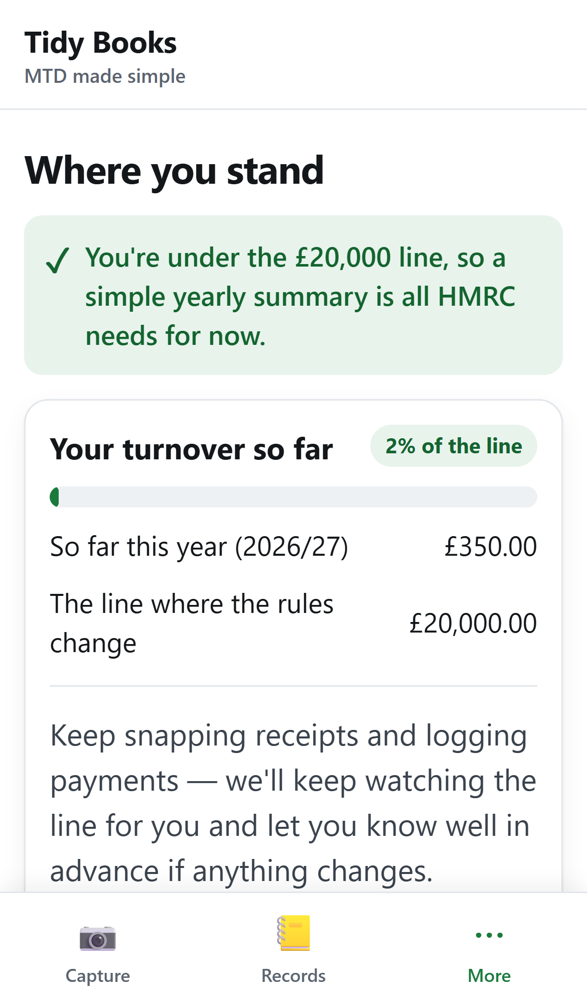
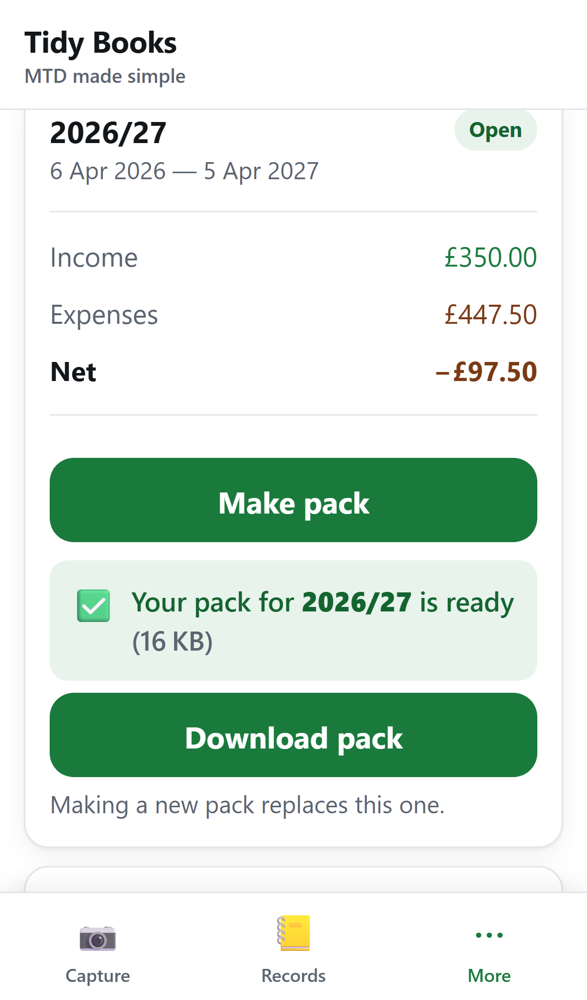

<p align="center">
  
</p>

<h1 align="center">EasyBooks</h1>
<p align="center">A phone app that turns a driving instructor's shoebox of receipts into clean, tax-ready records.</p>

<p align="center">
  
  
  
  
</p>

EasyBooks is a mobile-only, installable PWA for UK self-employed driving instructors who are
not technical. You photograph a receipt, the app reads it and suggests a category, you tap
"Looks right", and it is filed into clean records mapped to the HMRC SA103 self-employment
boxes. The whole thing is Python end to end with no build step, and it runs on a laptop with
an empty `.env` because every cloud dependency has a local fallback.

## ✨ Features

- **Scan and confirm**: photograph a receipt and a vision-LLM reads the amount, date and vendor and suggests a category; you just tap "Looks right" to file it (`app/ocr.py`).
- **Runs with no credentials**: an empty `.env` runs the full app on SQLite, the local filesystem, an OCR stub and console email, so it works offline end to end (`app/config.py`).
- **Plain-English tax status**: entries are mapped to SA103 boxes and turned into a no-jargon view of where you stand against the Making Tax Digital thresholds and quarterly deadlines (`app/sa103.py`, `app/tax.py`).
- **Accountant pack export**: one tap builds a ZIP containing a PDF summary (reportlab), a spreadsheet (openpyxl) and the receipt images.
- **Recurring entries**: tap-to-log repeats for regular lessons and costs, with suggestions detected from your own history (`app/routes/repeated.py`).
- **Multi-user with isolated accounts**: every database query goes through a per-user scoped `Repo`, the app's anti-IDOR backstop (`app/db.py`).
- **Passwordless sign-in**: a 6-digit code is emailed (or shown on screen in dev) instead of a password (`app/security.py`).
- **Installable PWA**: a web manifest plus service worker, designed for iPhone 12 Safari, so it adds to the home screen and behaves like an app with no App Store.

## 📸 Screenshots

|  |  |
|---|---|
|  <br> *Scan a receipt; the app reads amount, date and vendor* |  <br> *Or type an expense in by hand* |
|  <br> *Tidy monthly records, grouped by tax year* |  <br> *Where you stand, in plain English* |
|  <br> *One-tap pack to send to your accountant* |  |

## 🛠 Stack

Python 3.13 · FastAPI (single ASGI app) · Jinja2 + HTMX + Alpine.js (server-rendered, vendored,
no bundler) · hand-written CSS · SQLAlchemy 2.0 · reportlab + openpyxl for exports.

Production targets, each with a local fallback so nothing is required to run:

| Concern | Production | Local fallback |
|---|---|---|
| Database | Neon Postgres | SQLite (`./local.db`) |
| Blob storage | Cloudflare R2 | local filesystem (`./local_storage`) |
| Receipt OCR | a vision-LLM (Gemini / OpenAI / Claude / Groq) | stub that returns plausible data |
| Email / SMS | Resend / Twilio | printed to the server log |

The active provider is chosen from whichever env vars are present (`app/config.py`).

## 🚀 Run

```bash
python -m venv .venv && . .venv/Scripts/activate   # Windows cmd: .venv\Scripts\activate
pip install -r requirements.txt
uvicorn api.index:app --reload
```

Open **http://127.0.0.1:8000** on a phone-sized viewport. A demo account
(`demo@example.com`, pre-seeded with two tax years of data) is created on first run. Sign in
with any email; in dev the 6-digit code is shown on screen.

Checks:

```bash
python _smoke.py        # end-to-end integration across every screen
python run_review.py    # iPhone-12 Chromium walkthrough that screenshots each screen
                        #   (needs: playwright install chromium, app running)
```

## 🧠 How it works

A single ASGI app (`api/index.py`) wires CSRF and security-header middleware, then mounts one
router per slice. State changes go through the scoped `Repo`; provider choices (database,
storage, OCR, email, SMS) are resolved in `config.py` from the environment.

```
api/index.py   single Vercel Function: middleware, router wiring, dev seed
app/
  config.py        env settings + MTD thresholds/deadlines (config, not code)
  models.py db.py  SQLAlchemy models + scoped Repo (anti-IDOR)
  security.py      signed-cookie sessions, CSRF, OTP
  storage.py ocr.py notify.py   provider-swappable: R2/local, vision-LLM/stub, Resend/console
  sa103.py tax.py  SA103 box mapping + mandation engine + plain-English status
  export.py reminders.py
  routes/          core, media, auth, capture, records, categories, status, export, cron
  templates/       base.html + screens + HTMX partials
public/            app.css, app.js, manifest.json, sw.js, vendored htmx/alpine
```

## 🗺 Roadmap

Runs locally end to end. Deploy config for Vercel + Neon + R2 lives in `vercel.json`, but the
app is not currently hosted at a public URL.

- [ ] Deploy to a public URL (Vercel Function + Neon + R2)
- [ ] Wire a real OCR key by default (the stub is the offline default)
- Known limitation: with an empty `.env` on Vercel, data lives in ephemeral `/tmp` and resets on cold start; set `DATABASE_URL` (Neon) and the `R2_*` keys for persistence.
</content>
